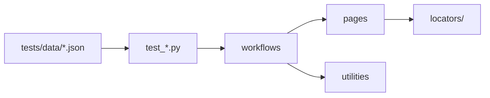

# eBay E2E Test Suite

[](https://playwright.dev/)
[](https://www.python.org/)
[](https://docs.pytest.org/)
[](https://allurereport.org/)
[](https://www.ebay.com/)
[](https://github.com/Zapkid/ebay-playwright-python/stargazers)

_End-to-end tests against [ebay.com](https://www.ebay.com) — search, pagination, add-to-cart, and cart-total verification._

[](https://github.com/Zapkid/ebay-playwright-python/actions/workflows/ci.yml)
[](https://github.com/Zapkid/ebay-playwright-python/stargazers)
[](https://github.com/Zapkid/ebay-playwright-python/network/members)
[](https://github.com/Zapkid/ebay-playwright-python/pulls)
[](https://github.com/Zapkid/ebay-playwright-python/issues)
[](https://github.com/Zapkid/ebay-playwright-python/graphs/contributors)


[automation-exercise.md](docs/automation-exercise.md) · [Exercise 5: ReadMeAIBugs.md](docs/ReadMeAIBugs.md)

## ⚡ Technologies


---

## Philosophy

**Thin tests, thick workflows.** Test files assert outcomes; multi-step flows live in `workflows/` and page interactions in `pages/`. Each layer has one job.

**Data-driven by default.** Search, cart, and pagination cases load from JSON. Add a row to `tests/data/*.json` — no code changes required.

**Guest first, login when needed.** Most E2E runs use a guest session with Ship-to-US cookies for USD pricing. Login tests and `--with-login` replay a saved session — programmatic sign-in is unreliable against eBay's CAPTCHA and bot detection.

**Small enough to navigate.** One browser per worker, isolated contexts per test, environment config in a single JSON file per profile. Reports, traces, and screenshots attach to Allure on failure.

---

## Requirements

| Tool                             | Install                                            |
| -------------------------------- | -------------------------------------------------- |
| [uv](https://docs.astral.sh/uv/) | `curl -LsSf https://astral.sh/uv/install.sh \| sh` |
| Python 3.13+                     | managed by uv                                      |
| Allure CLI                       | `brew install allure`                              |
| eBay account                     | login tests and `--with-login` only                |

```bash
uv sync                                          # creates .venv
source .venv/bin/activate                        # optional — uv run works without it
uv run python -m scripts.healthcheck             # optional preflight
```

---

## Quick start

```bash
cd /path/to/Ebay
uv sync
uv run playwright install chromium
uv run pytest tests/test_search_and_cart.py
allure serve reports/allure-results
```

Login tests and `--with-login` E2E need a one-time manual bootstrap:

```bash
uv run python -m scripts.bootstrap_ebay_auth   # saves secured_env_files/ebay-auth.json
uv run pytest tests/test_login.py
```

---

## What it supports

- **Search & cart E2E** — price-filtered search, add listings with variant/quantity handling, verify cart subtotal and budget cap (TC001–TC003, data-driven)
- **Pagination** — verify page 2 returns mostly new listings (PG001)
- **Session replay** — login validation via saved Playwright storage state
- **Parallel runs** — pytest-xdist, one worker per DDT case
- **Environment profiles** — `staging` / `preprod` / `prod` config folders (retries, traces, video, slow_mo)
- **Allure reporting** — steps, parameters, screenshots, traces; live `[search]` / `[cart]` / `[verify]` logs in terminal
- **CI-ready** — guest runs need no secrets; login runs restore `ebay-auth.json` from a GitHub Actions secret

---

## Running tests

Default pytest options (in `pyproject.toml`): `-s`, `-v`, Allure to `reports/allure-results`, live INFO logging.

### Test catalog

| File                        | Markers                        | Cases       | Verifies                                    |
| --------------------------- | ------------------------------ | ----------- | ------------------------------------------- |
| `test_search_and_cart.py`   | `search`, `cart`, `regression` | TC001–TC003 | Search → filter → cart → subtotal           |
| `test_search_pagination.py` | `search`, `pagination`         | PG001       | Page 2 mostly new listings                  |
| `test_login.py`             | `login`                        | 1           | Saved session replays                       |
| `test_bootstrap_auth.py`    | `bootstrap`                    | 1           | Manual sign-in (excluded from default runs) |

### Search & cart

Data from `tests/data/test_data.json`.

| Case  | Query            | Price   | Listings | Qty |
| ----- | ---------------- | ------- | -------- | --- |
| TC001 | wireless earbuds | $15–$60 | 3        | 1   |
| TC002 | phone case       | $10–$40 | 2        | 2   |
| TC003 | vintage watch    | $5–$50  | 4        | 1   |

```bash
uv run pytest tests/test_search_and_cart.py
uv run pytest tests/test_search_and_cart.py -n 3              # parallel
uv run pytest tests/test_search_and_cart.py -k TC001
HEADLESS=false uv run pytest tests/test_search_and_cart.py -k TC001
uv run pytest tests/test_search_and_cart.py --with-login
```

### Pagination

```bash
uv run pytest tests/test_search_pagination.py
uv run pytest -m pagination
```

### Login & bootstrap

Login tests auto-skip when `secured_env_files/ebay-auth.json` is missing.

```bash
uv run python -m scripts.bootstrap_ebay_auth
uv run python -m scripts.bootstrap_ebay_auth --force
HEADLESS=false uv run pytest -m bootstrap -s
uv run pytest tests/test_login.py
```

### Common patterns

```bash
uv run pytest tests/ -m "not login"                # CI-style (no auth)
uv run pytest tests/                               # full suite
TEST_ENV=staging uv run pytest tests/ -m "not login"
HEADLESS=false uv run pytest tests/test_search_and_cart.py
```

**Markers:** `search` · `cart` · `pagination` · `login` · `bootstrap` · `regression` · `smoke`

**Environment profiles** (`TEST_ENV`, default `preprod`):

| Profile   | `retry_count` | `trace_on_failure` | `record_video` | `slow_mo` |
| --------- | ------------- | ------------------ | -------------- | --------- |
| `staging` | 3             | yes                | yes            | 0         |
| `preprod` | 1             | no                 | no             | 0         |
| `prod`    | 1             | yes                | no             | 50 ms     |

Shell overrides: `HEADLESS`, `SLOW_MO`, `WITH_LOGIN` (same as `--with-login`), `DEFAULT_TIMEOUT` (max 15 s).

---

## Architecture

```txt
JSON data → tests/test_*.py → workflows/ → pages/ → ebay.com
                              ↘ utilities/ (config, auth, shipping, logging)
```



**Fixture lifecycle** (root `conftest.py`):

| Scope    | What                                                         |
| -------- | ------------------------------------------------------------ |
| session  | Playwright, Chromium, Ship-to-US storage state               |
| function | Isolated context + page; failure screenshots/traces → Allure |

Guest tests reuse `secured_env_files/shipping-us.json` (ZIP 95621) for USD pricing. Login tests and `--with-login` load `ebay-auth.json` instead. Auto-retry comes from `retry_count` in config via [pytest-rerunfailures](https://github.com/pytest-dev/pytest-rerunfailures).

### Key files

| Path                             | Role                                                       |
| -------------------------------- | ---------------------------------------------------------- |
| `conftest.py`                    | Browser fixtures, `--with-login`, Allure hooks, auto-retry |
| `tests/conftest.py`              | DDT parametrization from JSON, login guard for search/cart |
| `workflows/search_items.py`      | Search, price filter, collect URLs, CSV log                |
| `workflows/add_items_to_cart.py` | Variants, quantity, add-to-cart                            |
| `workflows/assert_cart_total.py` | Subtotal verification and budget cap                       |
| `workflows/paginate_search.py`   | Multi-page listing ID collection                           |
| `pages/`                         | Page Object Model — one class per eBay screen              |
| `pages/locators/`                | CSS selectors split by page                                |
| `utilities/config_loader.py`     | Load `resources/<env>/config.json`                         |
| `utilities/auth_storage.py`      | Save/load `ebay-auth.json`                                 |
| `utilities/shipping_storage.py`  | Ship-to-US session bootstrap                               |
| `scripts/bootstrap_ebay_auth.py` | Headed manual sign-in                                      |
| `scripts/healthcheck.py`         | Preflight before bootstrap                                 |
| `resources/<env>/config.json`    | Per-env browser and reporting settings                     |
| `pyproject.toml`                 | Dependencies, pytest config, markers                       |

### Output artifacts (git-ignored)

| Path                           | Contents                                                                 |
| ------------------------------ | ------------------------------------------------------------------------ |
| `reports/allure-results/`      | Allure raw results                                                       |
| `reports/traces/`              | Playwright traces — [trace.playwright.dev](https://trace.playwright.dev) |
| `reports/videos/`              | WebM when `record_video: true`                                           |
| `downloads/search_results.csv` | Search URL log                                                           |
| `screenshots/`                 | PNG captures                                                             |
| `secured_env_files/`           | `ebay-auth.json`, `shipping-us.json` (never commit)                      |

---

## Running in CI

Guest tests need no credentials. Login tests and `--with-login` require `secured_env_files/ebay-auth.json` restored from a GitHub Actions secret.

### Store `ebay-auth.json` as a secured secret

1. Bootstrap locally: `uv run python -m scripts.bootstrap_ebay_auth`
2. Encode: `base64 -i secured_env_files/ebay-auth.json | pbcopy`
3. GitHub → **Settings → Secrets and variables → Actions** → secret `EBAY_AUTH_JSON_B64`
4. Refresh when the session expires (sign-out, password change, replay failures)

Use an [environment secret](https://docs.github.com/en/actions/deployment/targeting-different-environments/using-environments-for-deployment) for stricter access. Never commit the session file.

### Workflow

```yaml
name: eBay E2E

on:
  push:
    branches: [main]
  pull_request:

jobs:
  e2e:
    runs-on: ubuntu-latest
    steps:
      - uses: actions/checkout@v4
      - uses: astral-sh/setup-uv@v4
        with:
          python-version: "3.13"
      - run: uv sync
      - run: uv run playwright install --with-deps chromium

      - name: Restore eBay auth session
        if: ${{ secrets.EBAY_AUTH_JSON_B64 != '' }}
        run: |
          mkdir -p secured_env_files
          echo "${{ secrets.EBAY_AUTH_JSON_B64 }}" | base64 -d > secured_env_files/ebay-auth.json
          test -s secured_env_files/ebay-auth.json

      - name: Run tests
        run: |
          if [ -f secured_env_files/ebay-auth.json ]; then
            uv run pytest tests/
          else
            uv run pytest tests/ -m "not login"
          fi
        env:
          TEST_ENV: preprod
          HEADLESS: "true"

      - uses: actions/upload-artifact@v4
        if: always()
        with:
          name: allure-results
          path: reports/allure-results/
```

For authenticated search/cart only (skip `test_login.py`):

```yaml
- run: uv run pytest tests/test_search_and_cart.py --with-login
  env:
    TEST_ENV: preprod
    HEADLESS: "true"
```

---

## FAQ

**Why session replay instead of programmatic login?**
eBay sign-in includes CAPTCHA, 2FA, and bot detection. A headed bootstrap once, then replay in CI, is the reliable approach.

**Why guest by default?**
Search and cart flows work without auth. Guest runs need no secrets and are faster to set up in CI.

**How do I add a new test case?**
Edit `tests/data/test_data.json` or `pagination_data.json`. Pytest picks it up via parametrization in `tests/conftest.py`.

**How do I debug a failure?**
Run headed: `HEADLESS=false uv run pytest … -k TC001`. Check Allure attachments (screenshots, traces). Open trace zips at [trace.playwright.dev](https://trace.playwright.dev). Enable `trace_on_failure: true` in your env config for richer artifacts.

**Why first variant, not random?**
Random size/color picks often change price or select premium options, breaking price-filter and budget assertions. Random selection can be accounted for — e.g. re-read the listing price after each variant pick and skip or adjust when it falls outside the filter range.

**Why Ship-to-US cookies?**
eBay shows different prices by shipping destination. Session-scoped ZIP 95621 cookies keep listings in USD across tests. Multi-currency support and conversion (parse locale-specific prices, normalize to a target currency before assertions) can be implemented if needed.

**How does `--with-login` work?**
Root `conftest.py` registers the flag and loads `ebay-auth.json` into browser `storage_state`. `tests/conftest.py` calls `ensure_logged_in()` before search/cart tests and fails fast if the session is invalid.

---

## Limitations

| Topic        | Note                                                                                    |
| ------------ | --------------------------------------------------------------------------------------- |
| Selectors    | CSS and ARIA preferred; XPath in fallback paths only                                    |
| Currency     | USD only; foreign-currency listings skipped                                             |
| Env profiles | Same URL (`ebay.com`); differ in retries, traces, video, slow_mo                        |
| Cart budget  | `subtotal ≤ budget_per_item × total_units`; optional `min_total` / `max_total` in JSON  |
| Quantity     | Set in JSON; product page tries select/input, falls back to repeated add-to-cart clicks |

---

## Dependency management

```bash
uv add <package>
uv lock --upgrade && uv sync
uv pip list
```

Dependencies are in `pyproject.toml`, pinned at major version.
